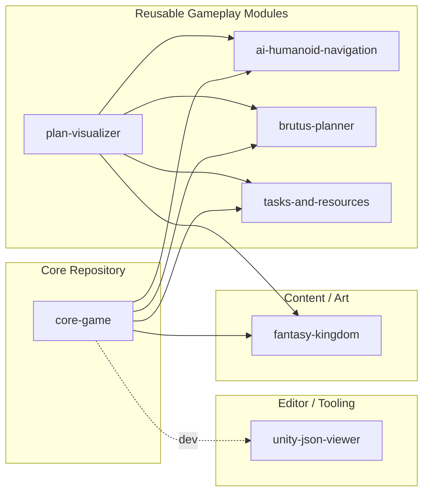
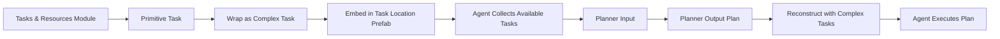

# Core Game Project

This repository contains the **core client code** for the simulation game.  
The world is driven by **emergent behavior**: NPC agents meet needs by constructing and executing plans, producing complex dynamics without central orchestration.

---

## 🎯 Architectural Philosophy

- **Modularity First**: The game is a **composition** of standalone modules with strict boundaries and tiny public surfaces.
- **Planner Agnostic**: The core provides **primitive actions + world state** to a planner and consumes the resulting plan; it does not know planner internals.
- **IOC for Effects**: Task effects (inventory, stats, animations) are **injected** into agents to keep concerns decoupled.
- **Emergent, Not Orchestrated**: Agents act on local perception (and limited memory), avoiding heavy global managers.

---

## 📦 Modules

- **ai-humanoid-navigation** — NPC motion, navmesh, locomotion animations.  
- **brutus-planner** — Action planner; input: primitive actions & world snapshot → output: plan.  
- **fantasy-kingdom** — Art assets (non-code).  
- **plan-visualizer** — Debug/test tool to visualize an example agent executing tasks.  
- **tasks-and-resources** — Static resource list and task definitions; creates **primitive tasks**.  
- **unity-json-viewer** — Editor tool for viewing/editing JSON (development-only).

---

## 🗺️ Module Dependency Graph

> Direction: `A --> B` means **A depends on B** (uses its public surface).

## 🧑‍🤝‍🧑 Agent Behavior

Each agent:

- Senses environment (e.g., sphere cast → detect task locations).

- Chooses a need to satisfy (hunger, sleep, etc.).

- Collects relevant tasks from local task locations.

- Example: a blacksmith offers Smelt Iron, Craft Sword.

- A well offers Gather Water.

- Feeds primitive actions into the planner.

- Executes chosen plan, with effects injected (stats, inventory, animations).

- Agents may also maintain a shortlist of known facts (memory of trading posts, locations, etc.) beyond direct vision.

## ⚒️ Tasks & Task Locations

- Task Locations are “points of creation” of tasks in the world (e.g., blacksmith, well).

- Each location provides a set of tasks (e.g., Sharpen Blade, Gather Water).

- Tasks are Unity-friendly wrappers around primitive planner actions.

- Primitive Task: minimal representation, planner-ready.

# Complex Task: ScriptableObject with metadata (animations, prefabs, effects).

Flow:

---

## 🧩 Inversion of Control

When an agent executes a task:

- Effects (inventory changes, stat updates) are applied externally.

- Animation data is injected into the agent from the task.

- This ensures tasks are modular and decoupled from the agent’s internal logic.

## 🚀 Design Goals

### Reusability: Modules like the planner or tasks/resources can power entirely different projects.

### Scalability: Adding new needs or tasks requires only defining new modules/resources.

### Debuggability: Visualization tools (plan-visualizer, unity-json-viewer) make it easy to test agents in isolation.

📌 Next Steps

Expand agent memory system for known facts beyond local perception.

Add more needs (shelter, trade, social).

Refine task trimming (filter irrelevant tasks before planning).

Formalize task location sub-objects for fine-grained animations/placement.
